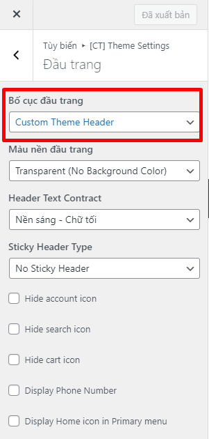

# Custom Header

To replace with custom header:

1. In Customizer, you must change **Header Theme** option



2. In `inc/child-theme-init.php` or `functions.php`

```php
add_action('wp', 'child_theme_custom_theme_header');
function child_theme_custom_theme_header() {
		$header = codetot_get_theme_mod('header_layout') ?? 'header-theme';

		if ($header === 'header-theme') {
			add_action('codetot_header', function () {
				the_block('header-theme');
			}, 1);
		}
	}
```

3. Create markup

Then create `blocks/header-theme.php` in your child theme.
